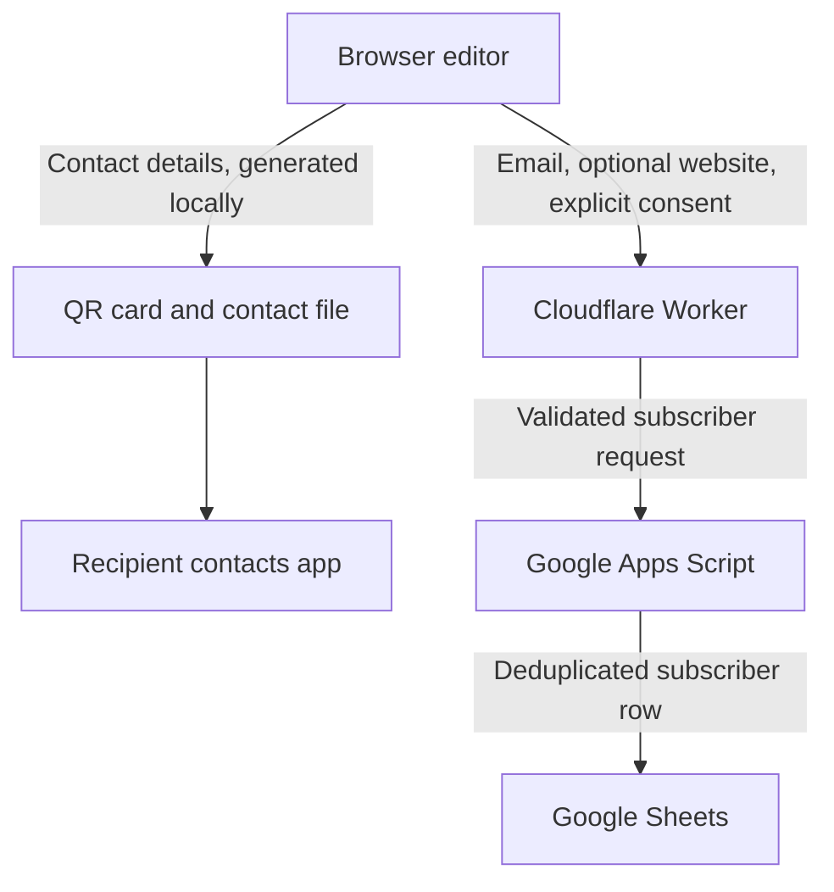

# Architecture

The One Card lives inside the existing website. Its contact editor runs in the browser; a separate Cloudflare Worker handles subscriber requests and the isolated analytics support.

## Contact and subscriber flows

The contact details in the first branch are intentionally shared through the downloaded files. The second branch stores only the disclosed subscriber fields.

## Boundaries

| Component | Responsibility | Data boundary |
| --- | --- | --- |
| Website | Serve the editor and preview | No account or hosted contact profile |
| Browser | Validate input, expand social links, render previews, generate QR and .vcf | The card remains in page memory |
| Cloudflare Worker | Validate signup, forward approved data, support analytics isolation | No stored card object or photo |
| Apps Script | Verify the authenticated backend request, lock writes, deduplicate email, maintain the sheet schema | No card details beyond email and optional website |
| Google Sheets | Hold subscriber and consent records | Access remains with the owner |
| GA4 and PostHog | Measure defined product events | No card content in event properties; no One Card session recording or autocapture |

The shared authentication secret stays in backend configuration. This case study does not include credentials, private spreadsheet identifiers, or deployment endpoints.

## Contact format

The QR carries a vCard payload directly. It does not point to a profile service. The contact file can include the uploaded photo; the QR excludes it to keep the payload manageable.

The frontend restricts URL schemes, escapes contact data, and validates input. The QR has a payload limit and preserves a quiet zone. The preview fits the QR to whole pixel module sizes when possible.

Changes to fields invalidate the generated output. A new generation creates a new snapshot. Previously downloaded files and imported contacts remain unchanged.

## Signup reliability

Email and explicit consent are required by the form. The backend independently validates consent and approved fields. Apps Script uses a lock and deduplicates by email, retaining the first subscription timestamp and updating the latest consent information.

A sheet write is separate from local card generation. The interface reports the email-save outcome and does not treat a failed write as proof that a subscription was recorded.

## Analytics

One Card uses an isolated frame for its analytics loading and an allowlist for event names and properties. Link events contain the type of link rather than its destination. Validation events identify a category rather than a submitted value.

The PostHog route forwards the permitted event data without the request's cookies or referrer. The PostHog visit identifier is temporary; GA4 has a separate measurement identity. Do Not Track and Global Privacy Control suppress One Card tracking.

The implementation cannot measure offline QR scans, successful imports into contacts apps, or later sharing of downloaded files.

## Operations

The website and One Card backend are separate deployments from the website repository. The original standalone prototype repository is not the production source.

Production signup and analytics depend on the backend configuration and third-party service availability. The public case study is documentation, not an installable copy of the application.
