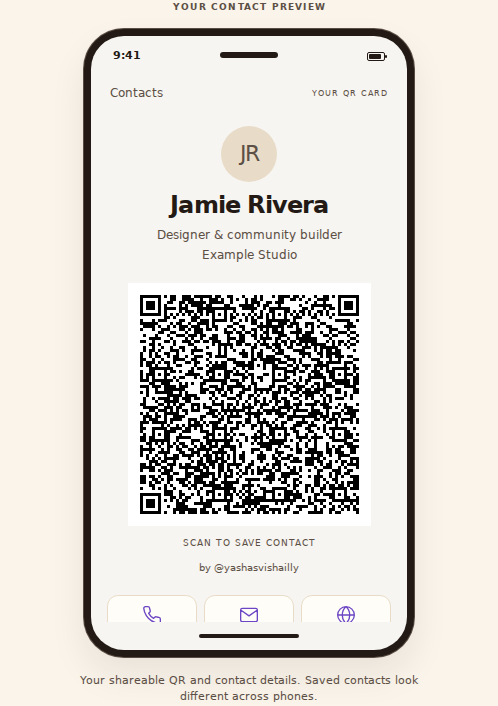
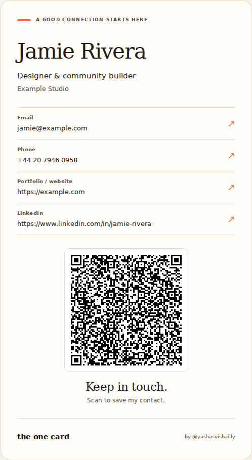

# Visual product notes

The One Card uses the existing website design system: cream surfaces, dark ink, poppy actions, violet links, Fraunces display type, and Figtree body type.

## Start with a neutral contact

The first screen uses “Your name”, “What you do”, and generic contact placeholders. It does not introduce a fictional named person as if their details were already entered.

The placeholders exist only in the preview. They do not populate the form, subscriber record, QR, or downloaded contact file.

## Show the result while someone types

The default preview is a phone-style contact screen. Name, role, company, contact methods, social links, and photo update as fields change. A second tab offers a compact card view.

The phone is an illustration of the contact, not a promise that every operating system will display exactly that screen.

## Put the QR on the phone

After generation, the QR appears inside the phone preview with the creator's name and **by @yashasvishailly** attribution. The contact details remain available below it. Downloads sit outside the device frame.

  
  

These are local browser captures of the implemented interface with fictional example data, not personal contacts or subscriber records. External web fonts may use local fallbacks in the captures. No live email submission was made to produce them.

## Small interaction choices

- Phone and WhatsApp fields include a fixed + and accept a pasted number with or without it.
- Social fields accept usernames or complete profile URLs; the preview shows the resulting link.
- The form and preview stack on narrow screens. Long names and URLs wrap.
- On short screens, the page can scroll the whole preview.
- Tabs and main actions have visible focus and usable tap targets.
- A photo appears in the contact file, but is omitted from QR imports.

## What the screenshots do not prove

The screens demonstrate the implemented interface. They do not demonstrate usage volume, recipient imports on every phone, production analytics ingestion, or conversion.
